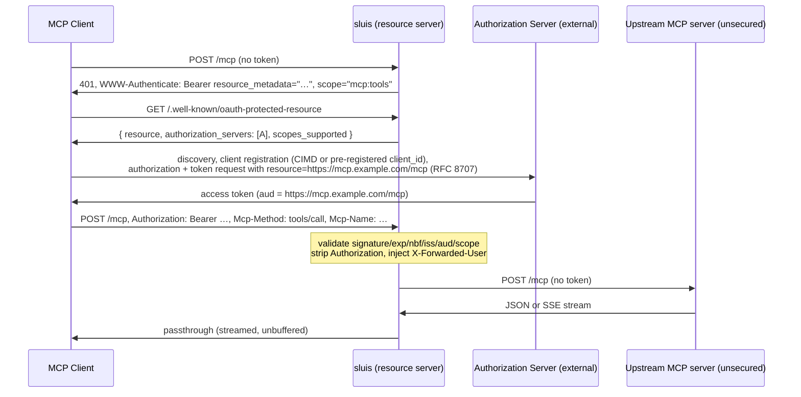

# sluis

**OAuth 2.1 resource-server proxy for MCP** — one controlled gate that traffic must pass through (*sluis*, Dutch: sluice / canal lock).

`sluis` puts the MCP authorization layer ([spec revision 2026-07-28](https://modelcontextprotocol.io/specification/2026-07-28/basic/authorization)) in front of an **unsecured** MCP server speaking Streamable HTTP. The upstream has no auth at all; the proxy is the only thing exposed to clients.

It is a **pure OAuth 2.1 resource server**. It does exactly three things:

1. Challenges unauthenticated requests with `401` + `WWW-Authenticate` pointing at its RFC 9728 Protected Resource Metadata.
2. Validates bearer tokens issued by a configured external authorization server — signature, expiry, issuer, **audience**, scopes.
3. Forwards valid requests to the upstream MCP server and streams responses back transparently.

It never mints tokens, never handles login, never implements DCR or CIMD fetching — the external authorization server (which registers clients via CIMD and/or manual pre-registration) does all of that. And it **never forwards client tokens upstream** (the token-passthrough anti-pattern).



## Endpoints

| Path | Auth | Purpose |
|---|---|---|
| `/.well-known/oauth-protected-resource` | none | RFC 9728 PRM (CORS: any origin, GET) |
| `/.well-known/oauth-protected-resource<mcp_path>` | none | RFC 9728 §3 path-suffixed variant |
| `<mcp_path>` (default `/mcp`) | bearer | Reverse proxy to the upstream MCP server |
| `/healthz` | none | Liveness — deliberately independent of IdP reachability |

Error responses:

- Missing token → `401` with `WWW-Authenticate: Bearer realm="mcp", resource_metadata="…", scope="…"`.
- Invalid/expired token → `401` with `error="invalid_token"`.
- Valid token, missing scopes → `403` with `error="insufficient_scope"` and the required `scope="…"`.
- Missing mandatory transport headers (strict mode) → `400` with JSON-RPC error `-32020` (`HeaderMismatch`).
- Client messages stay generic; detailed reasons are logged with a correlation id.

## Transport modes

**`strict` (default)** targets the 2026-07-28 Streamable HTTP binding: stateless, POST-only (`GET`/`DELETE` answer `405`), mandatory `MCP-Protocol-Version` and `Mcp-Method` headers, `Mcp-Name` mandatory for `tools/call` / `resources/read` / `prompts/get` (decided from the `Mcp-Method` header only — the proxy never parses bodies). `Mcp-Session-Id` and `Last-Event-ID` are ignored and not forwarded, per the spec's guidance for this revision.

**`2025` (`transport_compat: "2025"`)** for upstreams that still speak the 2025-era dialect (e.g. flux-operator-mcp): forwards `GET` (listening streams) and `DELETE` (session teardown), passes `Mcp-Session-Id` through transparently, and does not require the 2026 metadata headers (per-method scope overrides then apply only when `Mcp-Method` is present). **Authorization semantics are identical in both modes** — a `GET` needs a valid token exactly like a `POST`; compat only relaxes transport shape. Session ids are never used for authorization decisions.

In both modes, responses stream through unbuffered with no total-duration timeout, so long-lived streams (`subscriptions/listen`, SSE) survive.

## Token validation

Two modes, chosen with `token_validation`:

| | `jwks` (default) | `introspection` |
|---|---|---|
| Token type | JWT | opaque (or JWT) |
| Per-request cost | local crypto, no network | network round-trip to IdP (cached ≤ 30 s) |
| IdP outage | keeps working — cached keys are served stale, refresh failures only log a warning | requests fail `503` on cache misses |
| Revocation | **none before token expiry** — keep access-token lifetimes short at the IdP | takes effect within ≤ 30 s cache TTL |
| Extra config | — | `introspection_client_id` / `introspection_client_secret` |

Both modes validate the same policy: expiry/not-before with configurable clock skew, exact issuer pinning (tokens from any other issuer or realm are rejected even if the signature validates), **audience containment of the canonical resource URL**, and required scopes. Scopes are read from the `scope` claim (RFC 9068), with a fallback to the common `scp` variant.

JWKS operational details: keys are re-fetched when the cache TTL lapses or a token arrives with an unknown `kid`, rate-limited to one refresh per 10 s; a failed refresh never invalidates the cache. Only startup discovery is a hard failure (fail fast on misconfiguration).

**JOSE library**: [`jsonwebtoken`](https://crates.io/crates/jsonwebtoken) v11 with the pure-Rust `rust_crypto` provider — covers RS256/384/512, PS*, ES256/384, and EdDSA, fits the rustls/no-OpenSSL stack, and takes `DecodingKey`s directly from JWKs. Symmetric (`oct`) JWKS keys are rejected outright.

### Audience validation is not optional

The proxy rejects any token whose `aud` does not contain the canonical resource URL (`proxy_public_url` + `mcp_path`, e.g. `https://mcp.example.com/mcp`) — exact match, no catch-all values (`api`, the issuer URL, the bare host). This is the defense against tokens minted for *other* services at the same IdP being replayed here.

**IdP-side requirements** for this to work end to end:

- Clients need a way to get a `client_id`: **CIMD** (Client ID Metadata Documents) support at the AS so MCP clients can register by URL, and/or clients pre-registered manually whose credentials are handed to the MCP client (see [pre-registered clients with Claude Code](#with-claude-code)). Both work; sluis is agnostic to registration mode.
- The AS must set the token `aud` from the **RFC 8707 `resource` parameter** that MCP clients send (`resource=https://mcp.example.com/mcp`). In Keycloak that's an audience mapper / fine-grained resource support; in other IdPs the equivalent resource-indicator feature.
- Define the scope(s) you configure in `required_scopes` (default `mcp:tools`) and allow clients to request them.

If your IdP cannot issue per-resource audiences, that is a configuration problem to fix **at the IdP** — sluis will not paper over it with a lax audience check.

## Configuration

An optional YAML file (`--config` / `SLUIS_CONFIG`) plus `SLUIS_`-prefixed environment variables. Env beats file beats defaults; everything is deserialized once into a single typed struct and validated with explicit errors. Settings never become CLI flags.

| Key (env: `SLUIS_<UPPERCASED>`) | Default | Meaning |
|---|---|---|
| `proxy_public_url` | — (required) | External base URL; every advertised URL derives from this, never from `Host` headers |
| `upstream_mcp_url` | — (required) | The unsecured upstream MCP endpoint |
| `oidc_issuer_url` | — (required) | AS issuer; discovery tries `/.well-known/openid-configuration` then `/.well-known/oauth-authorization-server` |
| `mcp_path` | `/mcp` | MCP endpoint path; also the resource-URL suffix |
| `scopes_supported` | `mcp:tools` | Advertised in PRM (comma-separated in env) |
| `required_scopes` | `mcp:tools` | Enforced on every MCP request |
| `method_scopes` | `{}` | Per-`Mcp-Method` overrides, e.g. stricter scopes for `tools/call` (YAML only; replaces the global list for that method) |
| `token_validation` | `jwks` | `jwks` \| `introspection` |
| `transport_compat` | `strict` | `strict` \| `"2025"` |
| `introspection_client_id` / `_secret` | — | Required in introspection mode |
| `jwks_cache_ttl` | `300` | Seconds before background JWKS refresh |
| `clock_skew_secs` | `30` | Leeway on `exp`/`nbf` |
| `identity_headers_enabled` | `false` | Inject `X-Forwarded-User` (= `sub`) and `X-Forwarded-Scopes` upstream; inbound values are always stripped either way |
| `bind_addr` | `0.0.0.0:8080` | Listen socket |
| `upstream_connect_timeout_secs` | `5` | TCP connect timeout to upstream |
| `upstream_idle_timeout_secs` | disabled | Optional between-reads timeout; leave off if the upstream serves quiet long-lived streams without keep-alives |
| `shutdown_grace_secs` | `20` | SIGTERM drain deadline before aborting in-flight streams |
| `max_body_bytes` | `2097152` | Request body cap (2 MiB) |
| `allowed_origins` | unset | When set, requests with an `Origin` header not in the list get `403`; when unset, `Origin` is not checked (see security notes) |

Example `sluis.yaml`:

```yaml
proxy_public_url: https://mcp.example.com
upstream_mcp_url: http://127.0.0.1:9090/mcp
oidc_issuer_url: https://idp.example.com/realms/lab
required_scopes: [mcp:tools]
method_scopes:
  tools/call: [mcp:tools, mcp:tools:write]
identity_headers_enabled: true
```

## CLI

```
sluis serve [--config sluis.yaml]   # run the proxy (default subcommand)
sluis check [--config sluis.yaml]   # validate config + run discovery/JWKS fetch,
                                    # print resolved config with secrets redacted,
                                    # exit non-zero on any failure (CI / initContainer)
```

`--config` may also come from `SLUIS_CONFIG`; the flag wins. All other settings live exclusively in the YAML/env layers.

## Library use

The crate is a library with a thin binary. The centerpiece is `sluis::auth::McpAuthLayer`, a tower layer that turns **any** axum/tower service into an MCP-compliant protected resource — the reverse proxy is just this binary's use of it. Also public: the token validators (`JwksValidator`, `IntrospectionValidator`, the `TokenValidator` trait), the PRM builder, and the plain `Config` struct. `clap`/`config`/`anyhow` stay behind the default-on `cli` feature and never leak into the library API.

```rust
let layer = McpAuthLayer::new(validator, prm_url, vec!["mcp:tools".into()], Default::default());
let app = Router::new().route("/mcp", post(my_mcp_handler).layer(layer));
// my_mcp_handler can extract Extension<AuthContext> for sub + scopes
```

See [`examples/embedded.rs`](examples/embedded.rs).

## Operational behavior

- **IdP outage**: `/healthz` never depends on the IdP. JWKS mode serves cached keys stale on refresh failure. Only startup discovery hard-fails.
- **Graceful shutdown**: SIGTERM/SIGINT → stop accepting, drain in-flight requests up to `shutdown_grace_secs` (default 20 s), then abort remaining streams.
- **Streaming**: responses pass through with no buffering; `X-Accel-Buffering: no` from the upstream is forwarded as-is. No total-duration response timeout exists.
- **CORS**: permissive (`GET`, any origin) on `/.well-known/*` only — browser-based MCP clients fetch PRM cross-origin. No permissive CORS on the MCP endpoint.

## Security notes

- Client `Authorization` headers are stripped before proxying; the upstream never sees or depends on client tokens.
- Inbound `X-Forwarded-User`/`X-Forwarded-Scopes` are always stripped; when enabled they are re-injected from the *validated* token only.
- Tokens and `Authorization` headers are never logged. Per-request logs carry `Mcp-Method`/`Mcp-Name`/`sub`/status — an audit trail without bodies.
- Authorization is stateless and per-request: every request is validated independently; nothing is keyed on connections or client-supplied identifiers (session ids are opaque pass-through in compat mode).
- TLS terminates at the edge (ingress); the proxy serves HTTP and builds all URLs from `proxy_public_url`, never from `Host` headers.

### Deviations from the spec, flagged

- The Streamable HTTP spec says servers **MUST** validate the `Origin` header (DNS-rebinding defence, aimed mostly at locally-running servers). sluis makes this opt-in via `allowed_origins` because it typically runs behind a TLS-terminating ingress on a public hostname where rebinding does not apply, and an always-on check would break non-browser clients that send unexpected `Origin` values. **Set `allowed_origins` if the proxy is reachable from browsers on private networks.**
- The spec table marks `Mcp-Method` required for "all requests" but leaves header requirements for *notification* POSTs undefined (the 2026-07-28 core protocol defines no client→server notifications over Streamable HTTP). Strict mode requires `Mcp-Method` on every POST; an extension that sends notification POSTs without it would be rejected — use compat mode for such upstreams.
- The prompt-level challenge format is extended with the spec's **SHOULD**-level `scope` parameter on `401` challenges, giving clients least-privilege scope guidance up front.

## Trying it out

### With MCP Inspector

```sh
npx @modelcontextprotocol/inspector
```

Enter `https://mcp.example.com/mcp` as a Streamable HTTP server. The Inspector hits the endpoint, gets the `401`, fetches the PRM, discovers your AS, and walks the OAuth flow in the browser (your AS needs the Inspector's redirect URI allowed, or CIMD support). After consent, requests carry the token and land on the upstream.

### With Claude Code

```sh
claude mcp add --transport http canal-gate https://mcp.example.com/mcp
```

Claude Code detects the `401`, runs the same PRM → AS discovery → browser authorization flow, and stores the token. `/mcp` shows the connection; tool calls then flow through the proxy with per-request validation.

By default Claude Code registers itself at the AS dynamically (CIMD/DCR). A pre-registered client works just as well — whether the AS lacks dynamic registration or you simply want a fixed, admin-controlled client. Register a client at the AS and hand its credentials to Claude Code:

```sh
claude mcp add --transport http \
  --client-id sluis-claude-code \
  --client-secret \
  --callback-port 8976 \
  canal-gate https://mcp.example.com/mcp
```

- `--client-secret` prompts for the secret with masked input (or reads `MCP_CLIENT_SECRET`); omit it for a public client with PKCE.
- Register the redirect URI `http://localhost:8976/callback` at the AS — the path is fixed, the port must match `--callback-port`.
- The AS-side requirements from [audience validation](#audience-validation-is-not-optional) still apply to the pre-registered client: it must be allowed the configured scopes and get `aud` set from the RFC 8707 `resource` parameter.

Nothing changes on the sluis side: discovery and token validation are identical, and the proxy neither knows nor cares how the client obtained its `client_id`. Tokens minted for pre-registered clients (with their `client_id`/`azp` claims) are covered in the integration tests.

### Smoke test: compat mode in front of flux-operator-mcp

[flux-operator-mcp](https://fluxcd.control-plane.io/mcp/) speaks the 2025-era Streamable HTTP dialect (sessions, `initialize`, GET streams):

```sh
# 1. Run the upstream locally, no auth:
flux-operator-mcp serve --transport http --port 9090   # endpoint: http://127.0.0.1:9090/mcp

# 2. Run sluis in compat mode in front of it:
SLUIS_PROXY_PUBLIC_URL=https://mcp.example.com \
SLUIS_UPSTREAM_MCP_URL=http://127.0.0.1:9090/mcp \
SLUIS_OIDC_ISSUER_URL=https://idp.example.com/realms/lab \
SLUIS_TRANSPORT_COMPAT=2025 \
sluis serve

# 3. Verify the gate:
curl -si -XPOST localhost:8080/mcp | head -3                 # 401 + WWW-Authenticate
curl -s localhost:8080/.well-known/oauth-protected-resource  # PRM
TOKEN=$(...)   # obtain from your IdP with resource=https://mcp.example.com/mcp
curl -s -XPOST localhost:8080/mcp \
  -H "Authorization: Bearer $TOKEN" \
  -H 'Content-Type: application/json' -H 'Accept: application/json, text/event-stream' \
  -d '{"jsonrpc":"2.0","id":1,"method":"initialize","params":{"protocolVersion":"2025-06-18","capabilities":{},"clientInfo":{"name":"curl","version":"0"}}}'
# → initialize result + Mcp-Session-Id echoed through the proxy
```

### Docker / K3s

```sh
docker build -t sluis .
docker run -p 8080:8080 -e SLUIS_PROXY_PUBLIC_URL=... -e SLUIS_UPSTREAM_MCP_URL=... -e SLUIS_OIDC_ISSUER_URL=... sluis
```

A minimal K3s manifest (Deployment with `sluis check` as initContainer, Service, Ingress) is in [`deploy/k3s.yaml`](deploy/k3s.yaml).

## Development

```sh
cargo test --all-features        # unit + integration (wiremock AS, real mock upstream)
cargo clippy --all-features --all-targets -- -D warnings
cargo fmt --check
cargo deny check advisories licenses
```

An end-to-end suite against a **real Keycloak** (testcontainer, realm-imported with the exact IdP-side setup the README prescribes: `mcp:tools` client scope, audience mapper for the resource URL, pre-registered confidential clients) is ignored by default because it needs Docker:

```sh
cargo test --test keycloak -- --ignored
```

It covers both validation modes: JWKS (happy path, missing scope → 403, missing resource audience → 401) and introspection (happy path, audience enforcement, immediate rejection of a revoked token). CI runs it as a separate job. It doubles as a working reference for configuring any IdP — the realm import JSON is in [`tests/keycloak.rs`](tests/keycloak.rs).

No `unsafe` anywhere (`#![forbid(unsafe_code)]`).

## Future work (deliberately out of scope for v1)

- Per-tool scope routing on `Mcp-Name` (the `method_scopes` config shape extends naturally to a `name_scopes` sibling).
- Multi-upstream routing — run one sluis instance per upstream MCP server instead.
- Metrics endpoint (Prometheus), rate limiting, admin API/UI, multi-replica shared caches.
- DCR/CIMD handling, token issuance, or any authorization-server behavior — permanently out of scope; that's the IdP's job.
